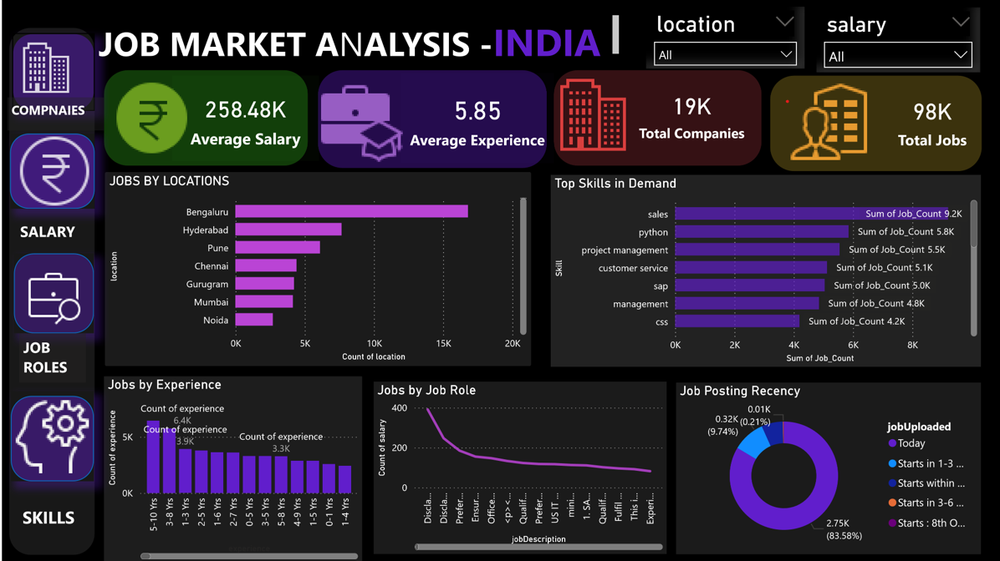
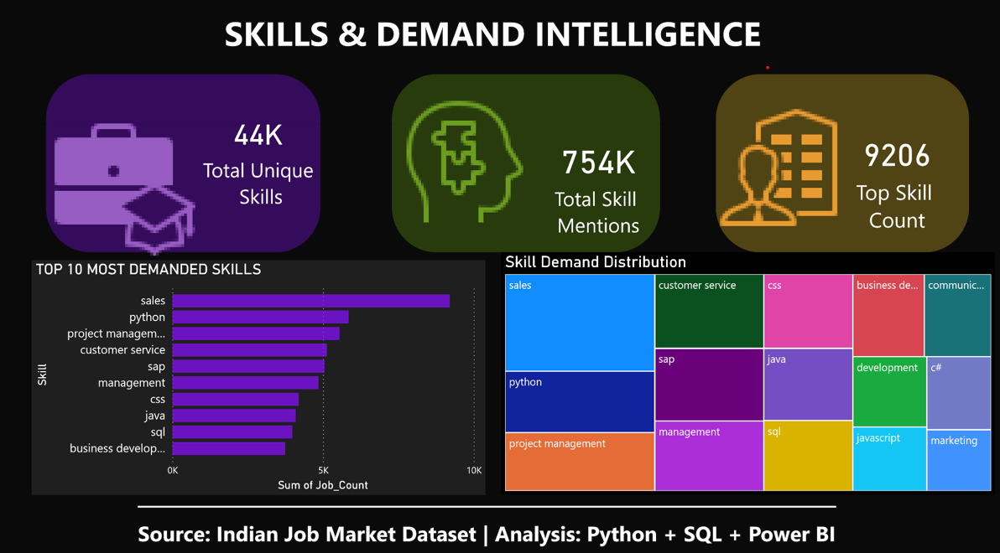

# 📊 Power BI Dashboard

## 🇮🇳 Indian Job Market Intelligence

An interactive Power BI dashboard designed to analyze Indian job market trends, salary patterns, job demand, locations, experience requirements, and skill demand.

---

## 📌 Dashboard Pages

### 1. Job Market Analysis

This dashboard provides an overview of:

- 💰 Average Salary
- 💼 Average Experience
- 🏢 Total Companies
- 👨‍💻 Total Jobs
- 📍 Jobs by Location
- 📊 Experience Distribution
- 📅 Job Posting Activity

---

### 2. Skills & Demand Intelligence

This page focuses on the skills demanded in the Indian job market.

It includes:

- 🎯 Total Unique Skills
- 📈 Total Skill Mentions
- 🔥 Top Skill Count
- 🏆 Top 10 Most Demanded Skills
- 📊 Skill Demand Distribution

---

## 📥 Interactive Dashboard

The complete interactive Power BI `.pbix` file is available in the **Releases** section of this repository.

### Dashboard Version

**v1.0.0**

The `.pbix` file can be downloaded and opened using **Power BI Desktop**.

---

## 🛠️ Tools Used

- Power BI
- Python
- SQL
- Pandas
- Data Visualization
